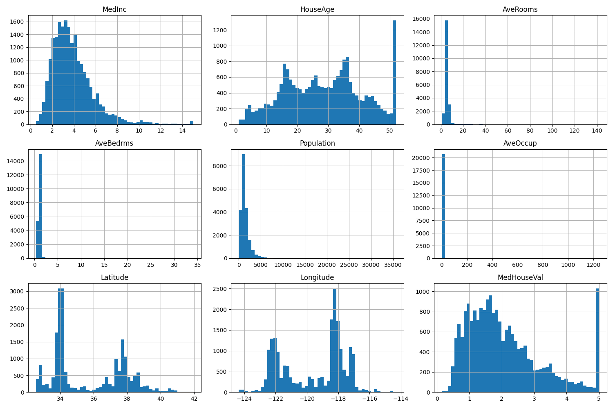
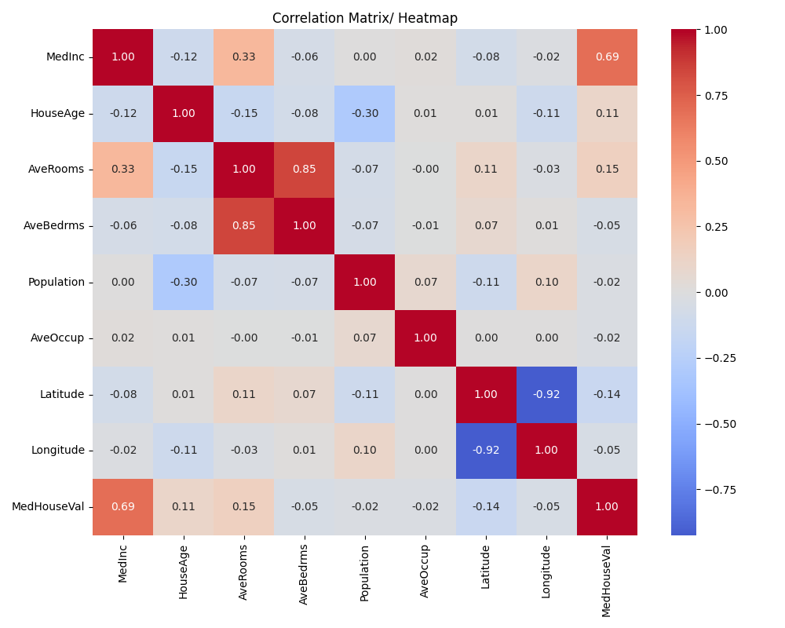
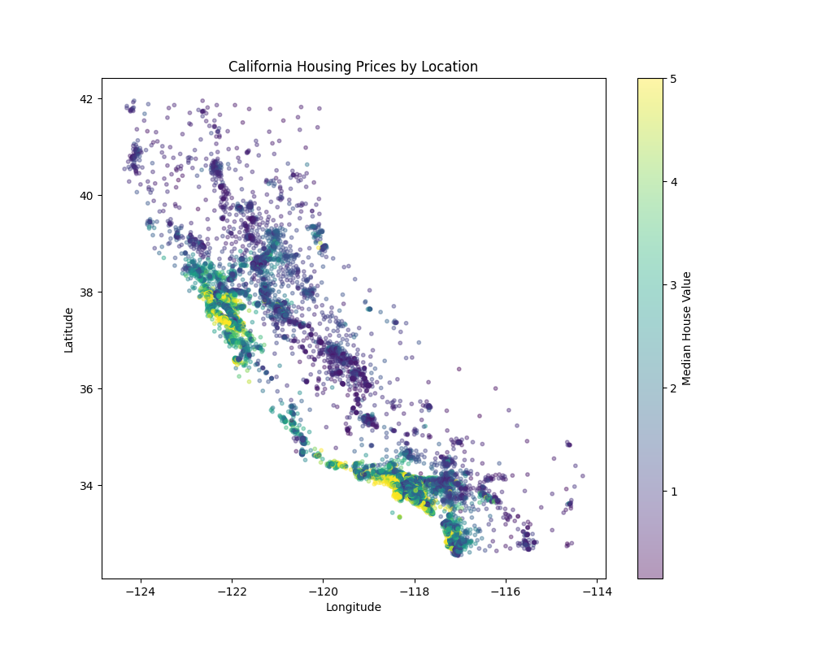
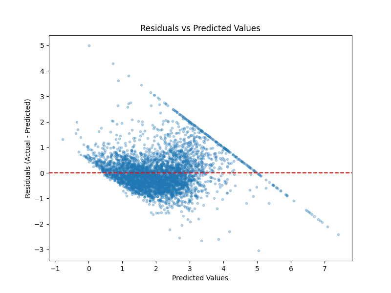

# California Housing Price Prediction

A Linear Regression project exploring the California Housing dataset — 
covering exploratory data analysis (EDA), preprocessing, and model evaluation.

## Dataset

The dataset comes from the 1990 California census, aggregated at the 
"block group" level (a small geographic unit of 600–3,000 people). It 
includes 8 features (median income, house age, rooms, bedrooms, population, 
occupancy, latitude, longitude) and one target: median house value.

Source: `sklearn.datasets.fetch_california_housing`

## Goals

- Practice structured EDA (univariate + bivariate analysis)
- Understand and handle outliers and multicollinearity
- Build and evaluate a Linear Regression model
- Interpret model coefficients and residuals critically

## EDA Highlights

- `MedInc` is right-skewed; `Latitude`/`Longitude` are multimodal, 
  reflecting California's population clusters (Bay Area, LA, San Diego)
- `MedHouseVal` and `HouseAge` show capping artifacts
- `AveRooms`, `AveBedrms`, `Population`, `AveOccup` contain extreme 
  outliers, confirmed via IQR-based boxplot analysis

- `MedInc` shows the strongest correlation with `MedHouseVal`

## Preprocessing

- Capped outliers in `AveRooms`, `AveBedrms`, `Population`, `AveOccup` 
  using the 1.5×IQR rule
- Checked multicollinearity using VIF
- Applied `StandardScaler`, fit only on training data to avoid leakage

## Model & Results

| Metric | Train | Test |
|--------|-------|------|
| R²     | 0.6692 | 0.6512 |
| RMSE   | 0.6650 | 0.6761 |
| MAE    | 0.4879 | 0.4964 | 
 

## Limitations

- **Target capping**: `MedHouseVal` is clipped at $500,000, causing a 
  diagonal pattern in residuals for high-value block groups
- **Linearity assumption**: a straight-line model likely can't capture 
  the true relationship between location and price
- **Missing features**: no crime rate, school quality, or property condition data

## Tech Stack

Python, pandas, NumPy, matplotlib, seaborn, scikit-learn, statsmodels
